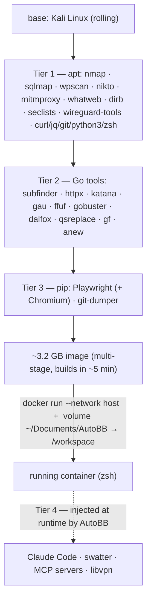

# Kali-BB

**A lightweight, purpose-built Kali Docker container for bug bounty.** A drop-in
replacement for an Exegol-style box: exactly the recon/web tooling I use, multi-stage
build in ~5 min instead of ~2 h, ~3.2 GB instead of ~15 GB, `--network host`, no GUI/VPN
wrapper baggage.

[]()
[]()
[](LICENSE)

> Container of offensive web/recon tooling — use it only against assets you're authorized
> to test (bug-bounty in-scope, lab, sanctioned engagement).

## What's in the image



`Makefile` targets: `build` · `run` · `shell` · `stop` · `update`. Also a `docker-compose.yml`.

## Quick Start

```bash
# Build l'image
make build

# Lancer le container
make run

# Ouvrir un shell
make shell

# Arrêter et supprimer
make stop

# Rebuild + restart
make update
```

## Outils inclus

### Tier 1 — apt (Kali repos)
nmap, sqlmap, wpscan, nikto, mitmproxy, whatweb, dirb, seclists, whois, dnsutils, sqlite3, wireguard-tools, iproute2, openssl, wget, jq, curl, git, python3, zsh

### Tier 2 — Go
subfinder, httpx, katana, gau, ffuf, gobuster, dalfox, qsreplace, gf, anew

### Tier 3 — pip
playwright (+ Chromium), git-dumper

### Tier 4 — injectés au runtime par AutoBB
Claude Code, swatter, telegram-mcp, libvpn-mcp

## Volumes

| Host | Container | Mode |
|------|-----------|------|
| `~/Documents/AutoBB` | `/workspace` | rw |

## Réseau

`--network host` — pas d'isolation, DNS hôte, pas de port mapping nécessaire.

## Taille

~3.2 GB (vs 15 GB Exegol full)

## docker-compose

```bash
docker compose up -d
docker compose exec autobb zsh
```

## See also

- [`swatter`](https://github.com/ZZ0R0/swatter) — the recon/fingerprinting tool this container is built to run.

## License

[MIT](LICENSE)

---

<sub>Part of my work — more at <a href="https://zz0r0.fr">zz0r0.fr</a>.</sub>
